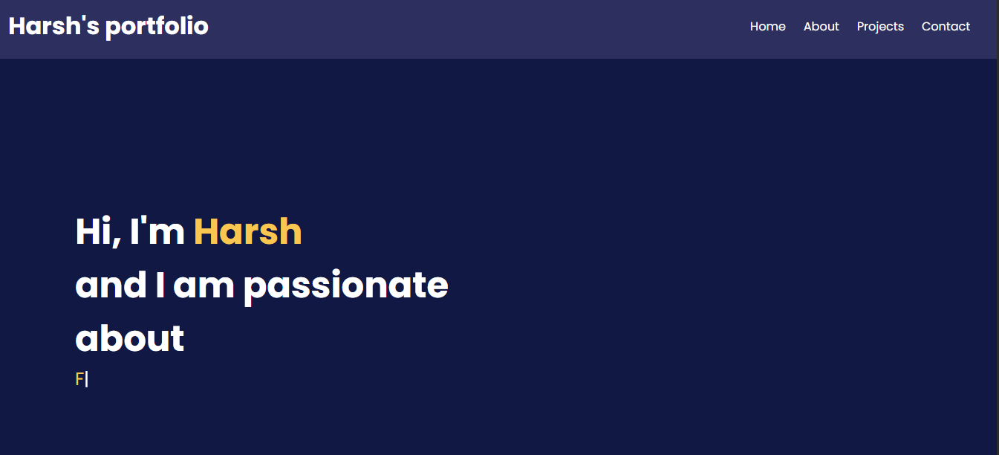

# 🌐 Harsh's portfolio-website

Welcome to my personal portfolio website! This project showcases my skills, projects, education, achievements, and contact information in a clean, modern, and responsive design.

## 🚀 Live Demo

🔗 https://portfolio-website-eosin-xi-13.vercel.app

## 📸 Preview

> Add a screenshot of your portfolio here.



## ✨ Features

- Responsive and modern UI
- Sticky navigation bar
- Smooth scrolling between sections
- Interactive About section with tabs
- Skills, Education & Achievements
- Projects showcase
- Contact form integration
- Social media links (GitHub & LinkedIn)
- Clean and organized code

## 🛠️ Built With

- HTML5
- CSS3
- JavaScript
- Git & GitHub
- Font Awesome
- Typed.js

## 📂 Project Structure

```
portfolio/
│── index.html
│── style.css
│── script.js
│── images/
│── certificates/
└── README.md
```

## 💡 What I Learned

Through this project, I improved my understanding of:

- Responsive Web Design
- CSS Flexbox
- JavaScript DOM Manipulation
- Smooth Scrolling
- Interactive UI Components
- Git & GitHub Workflow
- Project Organization

## 👨‍💻 About Me

I'm **Harsh**, a B.Tech student passionate about software and web development. I enjoy building modern websites, learning new technologies, and continuously improving my programming skills through practical projects.

### Current Skills

- C
- C++
- Python
- HTML
- CSS
- JavaScript
- Git
- GitHub

## 📬 Contact

📧 Email: 2006harshsaini@gmail.com

🔗 LinkedIn: www.linkedin.com/in/harsh-saini-978a0b379

💻 GitHub: https://github.com/2006harshsaini-sys

---

⭐ If you like this project, consider giving it a **Star**!